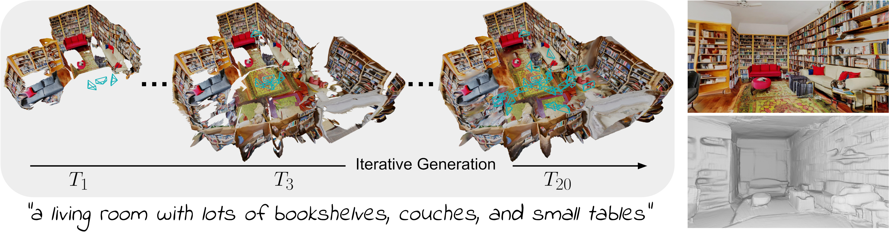

# Text2Room
Text2Room generates textured 3D meshes from a given text prompt using 2D text-to-image models.The goal could be to create a more immersive and interactive experience for people by allowing them to translate their digital conversations into real-life actions

This is the official repository that contains source code for the arXiv paper [Text2Room](https://lukashoel.github.io/text-to-room/).

[[arXiv](https://arxiv.org/abs/2303.11989)] [[Project Page](https://lukashoel.github.io/text-to-room/)] [[Video](https://youtu.be/fjRnFL91EZc)]



If you find Text2Room useful for your work please cite:
```
@preprint{hoellein2023text2room,
  title={Text2Room: Extracting Textured 3D Meshes from 2D Text-to-Image Models},
  author={H{\"o}llein, Lukas and Cao, Ang and Owens, Andrew and Johnson, Justin and Nie{\ss}ner, Matthias},
  journal={arXiv preprint arXiv:2303.11989},
  year={2023}
}
```

## Prepare Environment

Create a conda environment:

```
conda create -n text2room python=3.9
conda activate text2room
pip install -r requirements.txt
```

Then install Pytorch3D by following the [official instructions](https://github.com/facebookresearch/pytorch3d/blob/main/INSTALL.md).
For example, to install Pytorch3D on Linux (tested with PyTorch 1.13.1, CUDA 11.7, Pytorch3D 0.7.2):

```
conda install -c fvcore -c iopath -c conda-forge fvcore iopath
pip install "git+https://github.com/facebookresearch/pytorch3d.git@stable"
```

Download the pretrained model weights for the fixed depth inpainting model, that we use:

- refer to the [official IronDepth implemention](https://github.com/baegwangbin/IronDepth) to download the files ```normal_scannet.pt``` and ```irondepth_scannet.pt```.
- place the files under ```text2room/checkpoints```

(Optional) Download the pretrained model weights for the text-to-image model:

- ```git clone https://huggingface.co/stabilityai/stable-diffusion-2-inpainting```
- ```git clone https://huggingface.co/stabilityai/stable-diffusion-2-1```
- ```ln -s <path/to/stable-diffusion-2-inpainting> checkpoints```
- ```ln -s <path/to/stable-diffusion-2-1> checkpoints```

## Generate a Scene

As default, we generate a living room scene:

```python generate_scene.py```

Outputs are stored in ```text2room/output```.

### Generated outputs

We generate the following outputs per generated scene:

```
Mesh Files:
    <output_root>/fused_mesh/after_generation.ply: generated mesh after the first stage of our method
    <output_root>/fused_mesh/fused_final.ply: generated mesh after the second stage of our method
    <output_root>/fused_mesh/x_poisson_meshlab_depth_y.ply: result of applying poisson surface reconstruction on mesh x with depth y
    <output_root>/fused_mesh/x_poisson_meshlab_depth_y_quadric_z.ply: result of applying poisson surface reconstruction on mesh x with depth y and then decimating the mesh to have at least z faces
    
Renderings:
    <output_root>/output_rendering/rendering_t.png: image from pose t, that was rendered from the final mesh
    <output_root>/output_rendering/rendering_noise_t.png: image from a slightly different/noised pose t, that was rendered from the final mesh
    <output_root>/output_depth/depth_t.png: depth from pose t, that was rendered from the final mesh
    <output_root>/output_depth/depth_noise_t.png: depth from a slightly different/noised pose t, that was rendered from the final mesh

Metadata:
    <output_root>/settings.json: all arguments used to generate the scene
    <output_root>/seen_poses.json: list of all poses in Pytorch3D convention used to render output_rendering (no noise)
    <output_root>/seen_poses_noise.json: list of all poses in Pytorch3D convention used to render output_rendering (with noise)
    <output_root>/transforms.json: a file in the standard NeRF convention (e.g. see NeRFStudio) that can be used to optimize a NeRF for the generated scene. It refers to the rendered images in output_rendering (no noise).
```

We also generate the following intermediate outputs during generation of the scene:

```
    <output_root>/fused_mesh/fused_until_frame_t.ply: generated mesh using the content until pose t
    <output_root>/rendered/rendered_t.png: image from pose t, that was rendered from mesh_t
    <output_root>/mask/mask_t.png: mask from pose t, that signals unobserved regions
    <output_root>/mask/mask_eroded_dilated_t.png: mask from pose t, after applying erosion/dilation
    <output_root>/rgb/rgb_t.png: image from pose t, that was inpainted with the text-to-image model
    <output_root>/depth/rendered_depth_t.png: depth from pose t, that was rendered from mesh_t
    <output_root>/depth/depth_t.png: depth from pose t, that was predicted/aligned from rgb_t and rendered_depth_t
    <output_root>/rgbd/rgbd_t.png: combination of rgb_t and depth_t placed next to each other
```

### Create a scene from a fixed start-image

Already have an in-the-wild image, from which you want to start the generation?
Specify it as ```--input_image_path``` and the generated scene kicks-off from there.

```python generate_scene.py --input_image_path sample_data/0.png```

### Create a scene from another room type

Generate indoor-scenes of arbitrary rooms by specifying another ```--trajectory_file``` as input:

```python generate_scene.py --trajectory_file model/trajectories/examples/bedroom.json```

We provide a bunch of [example rooms](model/trajectories/examples).

### Customize Generation

We provide a highly configurable method. See [opt.py](model/utils/opt.py) for a complete list of the configuration options.

### Get creative!

You can specify your own prompts and camera trajectories by simply creating your own ```trajectory.json``` file.

#### Trajectory Format

Each ```trajectory.json``` file should satisfy the following format:

```
[
  {
    "prompt": (str, optional) the prompt to use for this trajectory,
    "negative_prompt": (str, optional) the negative prompt to use for this trajectory,
    "n_images": (int, optional) how many images to render between start and end pose of this trajectory,
    "surface_normal_threshold": (float, optional) the surface_normal_threshold to use for this trajectory
    "fn_name": (str, required) the name of a trajectory_function as specified in model/trajectories/trajectory_util.py
    "fn_args": (dict, optional) {
      "a": value for an argument with name 'a' of fn_name,
      "b": value for an argument with name 'b' of fn_name,
    },
    "adaptive": (list, optional) [
      {
        "arg": (str, required) name of an argument of fn_name that represents a float value,
        "delta": (float, required) delta value to add to the argument during adaptive pose search,
        "min": (float, optional) minimum value during search,
        "max": (float, optional) maximum value during search
      }
    ]
  },
  
  {... next trajectory with similar structure as above ...}
]
```

#### Adding new trajectory functions

We provide a bunch of predefined trajectory functions in [trajectory_util.py](model/trajectories/trajectory_util.py).
Each ```trajectory.json``` file is a combination of the provided trajectory functions. 
You can create custom trajectories by creating new combinations of existing functions.
You can also add custom trajectory functions in [trajectory_util.py](model/trajectories/trajectory_util.py).
For automatic integration with our codebase, custom trajectory functions should have the following pattern:

```
def custom_trajectory_fn(current_step, n_steps, **args):
    # n_steps: how many poses including start and end pose in this trajectory
    # current_step: pose in the current trajectory
    
    # your custom trajectory function here...

def custom_trajectory(**args):
    return _config_fn(custom_trajectory_fn, **args)
```

This lets you reference ```custom_trajectory``` as ```fn_name``` in a ```trajectory.json``` file.

## Render an existing scene

We provide a script that renders images from a mesh at different poses:

```python render_cameras.py -m <path/to/mesh.ply> -c <path/to/cameras.json>```

where you can provide any cameras in the Pytorch3D convention via ```-c```.
For example, to re-render all poses used during generation and completion:

```
python render_cameras.py \
-m <output_root>/fused_mesh/fused_final_poisson_meshlab_depth_12.ply \
-c <output_root>/seen_poses.json
```

## Optimize a NeRF

We provide an easy way to train a NeRF from our generated scene.
We save a ```transforms.json``` file in the standard NeRF convention, that can be used to optimize a NeRF for the generated scene.
It refers to the rendered images in ```<output_root>/output_rendering```.
It can be used with standard NeRF frameworks like [Instant-NGP](https://github.com/NVlabs/instant-ngp) or [NeRFStudio](https://github.com/nerfstudio-project/nerfstudio).

## Acknowledgements

Our work builds on top of amazing open-source networks and codebases. 
We thank the authors for providing them.

- [IronDepth](https://github.com/baegwangbin/IronDepth) [1]: a method for monocular depth prediction, that can be used for depth inpainting.
- [StableDiffusion](https://huggingface.co/stabilityai/stable-diffusion-2-inpainting) [2]: a state-of-the-art text-to-image inpainting model with publicly released network weights.

[1] IronDepth: Iterative Refinement of Single-View Depth using Surface Normal and its Uncertainty, BMVC 2022, Gwangbin Bae, Ignas Budvytis, and Roberto Cipolla

[2] High-Resolution Image Synthesis with Latent Diffusion Models, CVPR 2022, Robin Rombach, Andreas Blattmann, Dominik Lorenz, Patrick Esser, and Björn Ommer
